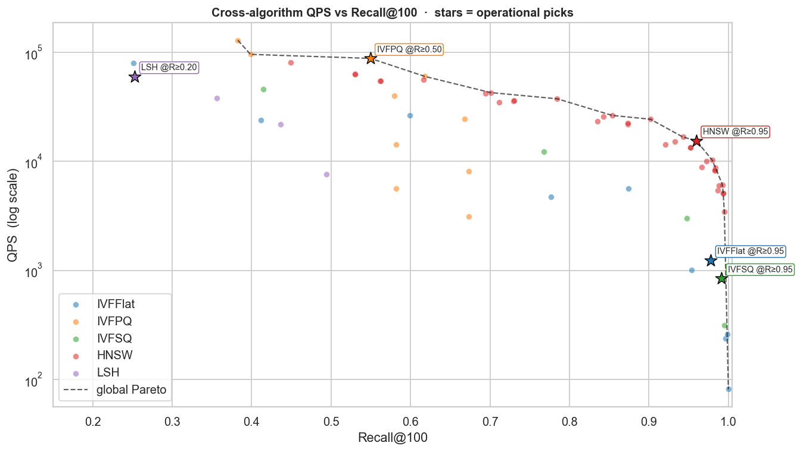
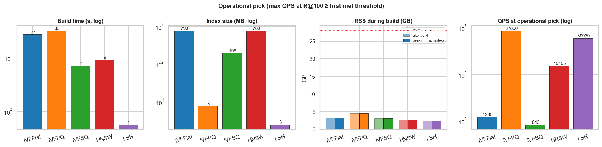
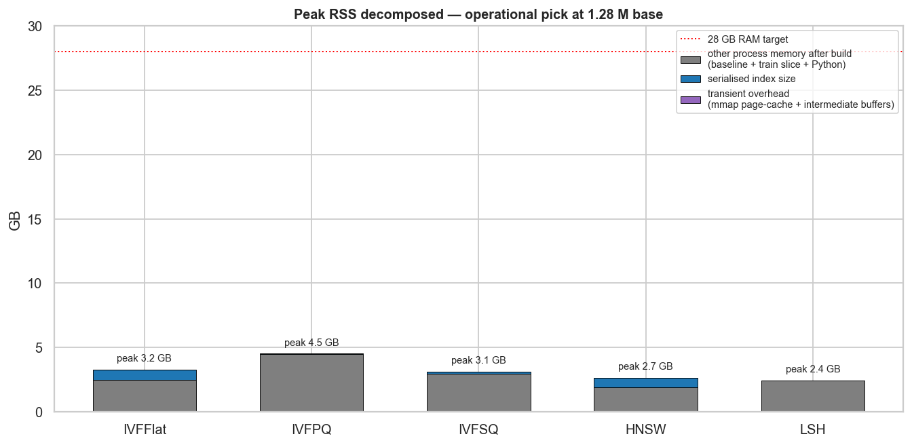
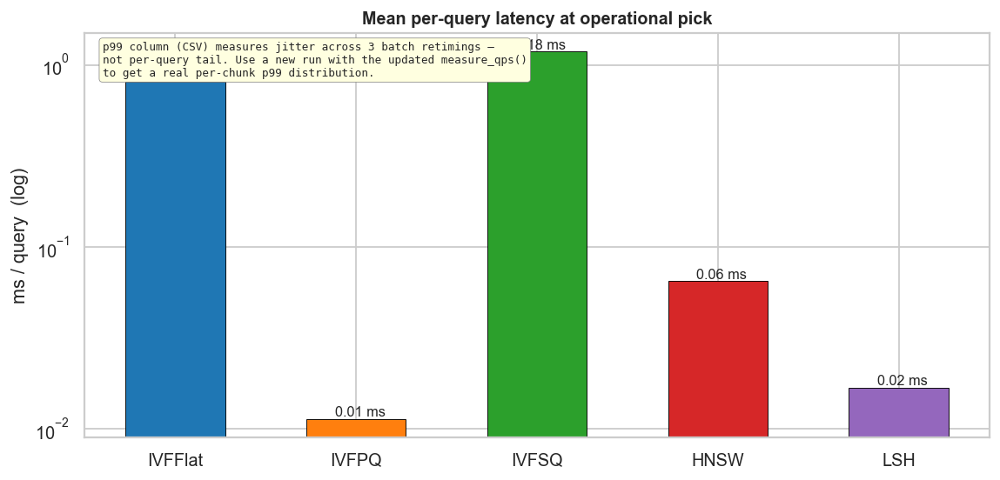
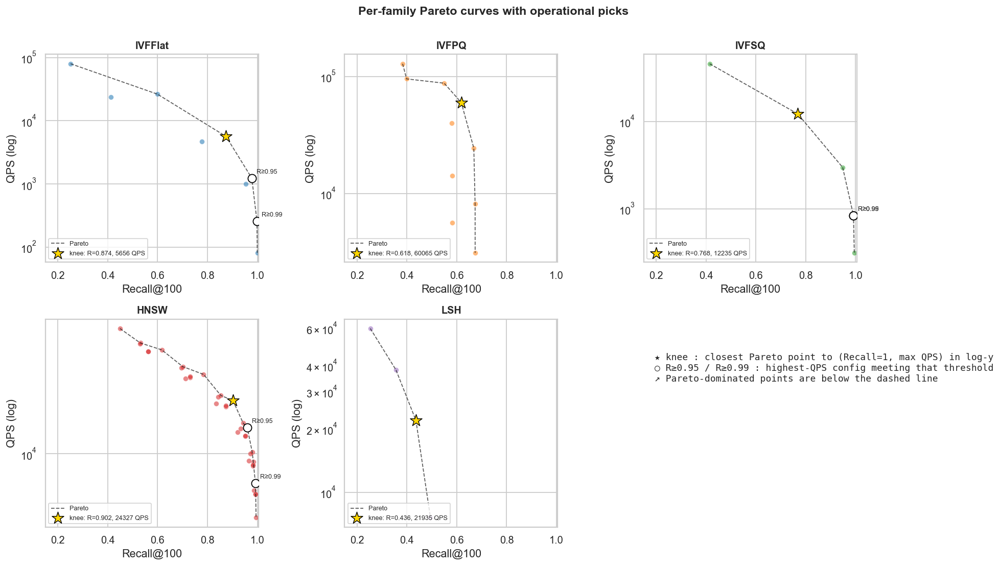
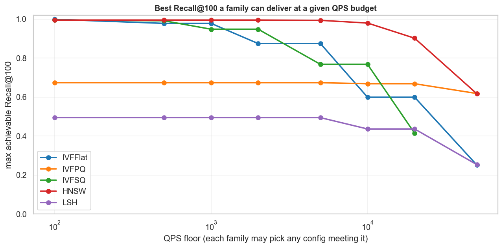
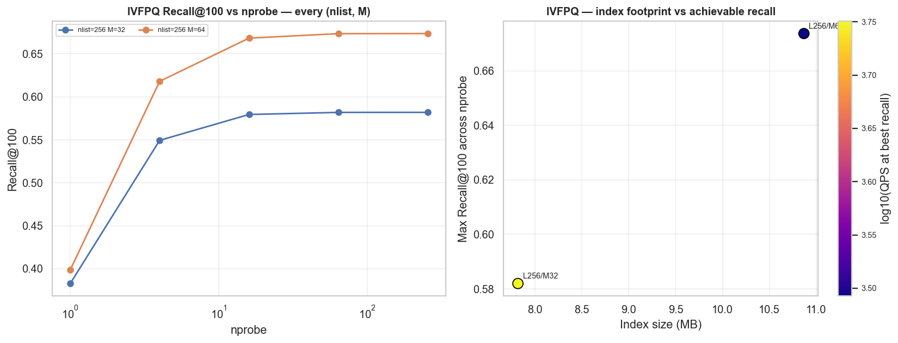
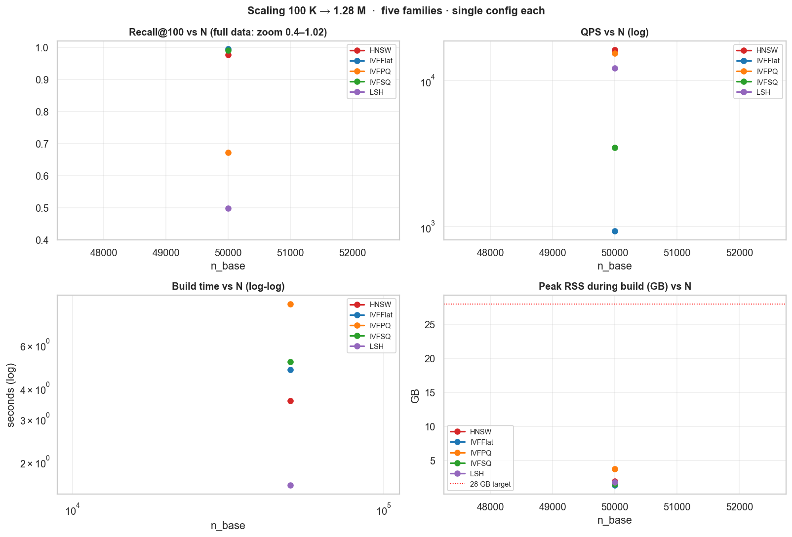
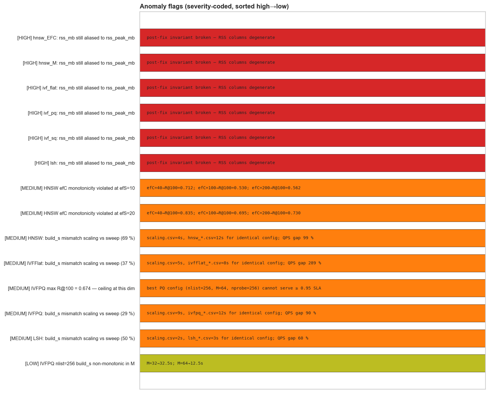
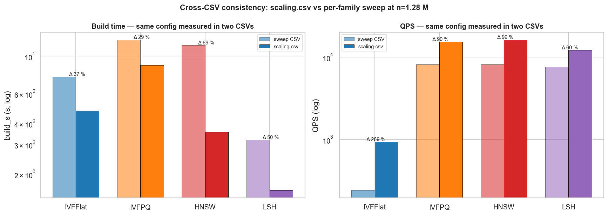

# Краткий отчёт по FAISS-ANN бенчмарку — прогон `light`

> Краткая версия. Все графики и числа сохранены, пояснения сведены к минимуму. Подробные объяснения и доказательства аномалий — в `OTCHET_polnyj.md`.

> Сгенерирован `scripts/analyze_and_report.py` из CSV в `results/light/`. Графики — `docs/img/light/`.

## 1. Условия эксперимента

- **Датасет:** ImageNet-1M ZJU, 2048-D, n_base = 50,000, n_query = 10 000 (для свипов), n_gt = 25 000.
- **Метрика расстояния:** L2.
- **Платформа:** local single-host (см. notebook 01 для деталей RAM/CPU).
- **QPS-замер:** `LAB_QPS_REPEAT=3 LAB_QPS_WARMUP=1` (warmup + медиана 3 запусков).
- **Свипы:** IVFFlat 10 конфигов, IVFPQ 10, IVFSQ 5, HNSW 36 (varyM + varyEFC), LSH 4.

## 2. Сводка результатов

### 2.1. Operational picks (макс. QPS при первом достижимом recall-флоре)

| Семейство | Recall флор | Recall@100 | QPS | Mean lat. | Index size | Build | Peak RSS | Конфиг |
|---|---:|---:|---:|---:|---:|---:|---:|---|
| **IVFFlat** | 0.95 | 0.9780 | 1,235 | 0.809 мс | 790 МБ | 27.4 с | 3.24 ГБ | `nlist=1024, nprobe=64` |
| **IVF+PQ** | 0.50 | 0.5494 | 87,890 | 0.011 мс | 8 МБ | 32.5 с | 4.50 ГБ | `nlist=256, nprobe=4, M=32, nbits=8` |
| **IVF+SQ** | 0.95 | 0.9913 | 843 | 1.183 мс | 198 МБ | 7.0 с | 3.13 ГБ | `nlist=256, nprobe=64, sq=SQ8` |
| **HNSW** | 0.95 | 0.9597 | 15,455 | 0.065 мс | 789 МБ | 9.2 с | 2.65 ГБ | `M=8, efConstruction=200, efSearch=160` |
| **LSH** | 0.20 | 0.2531 | 59,939 | 0.017 мс | 3 МБ | 0.6 с | 2.41 ГБ | `nbits=128` |

### 2.2. «Колено» Парето-кривой по каждому семейству

| Семейство | Recall@100 | QPS | Index size | Конфиг |
|---|---:|---:|---:|---|
| IVFFlat | 0.8744 | 5,656 | 790 МБ | `nlist=1024, nprobe=16` |
| IVF+PQ | 0.6181 | 60,065 | 11 МБ | `nlist=256, nprobe=4, M=64, nbits=8` |
| IVF+SQ | 0.7678 | 12,235 | 198 МБ | `nlist=256, nprobe=4, sq=SQ8` |
| HNSW | 0.9019 | 24,327 | 789 МБ | `M=8, efConstruction=200, efSearch=80` |
| LSH | 0.4362 | 21,935 | 10 МБ | `nbits=512` |

### 2.3. Победители по квадрантам (по всему свипу)

- **Максимальный Recall@100:** IVFFlat = 1.0000 (`nlist=256, nprobe=256`).
- **Максимальный QPS:** IVF+PQ = 128,852 при recall 0.383 (`nlist=256, nprobe=1, M=32, nbits=8`).
- **Минимальный размер индекса:** LSH = 3 МБ (`nbits=128`).
- **Самый быстрый билд:** LSH = 0.6 с (`nbits=128`).

## 3. Анализ по семействам

### 3.1. IVFFlat

- **Размер свипа:** 10 конфигов.
- **Recall@100:** 0.251 → 1.0000.
- **QPS:** 82 → 79,677.
- **Размер индекса:** 784 МБ → 790 МБ.
- **Build:** 7.5 с → 27.4 с.

Лучшая конфигурация при каждом recall-флоре:

| Recall флор | Конфиг | Recall@100 | QPS | Mean lat. |
|---:|---|---:|---:|---:|
| 0.99 | `nlist=1024, nprobe=256` | 0.9985 | 258 | 3.867 мс |
| 0.95 | `nlist=1024, nprobe=64` | 0.9780 | 1,235 | 0.809 мс |
| 0.90 | `nlist=1024, nprobe=64` | 0.9780 | 1,235 | 0.809 мс |
| 0.80 | `nlist=1024, nprobe=16` | 0.8744 | 5,656 | 0.177 мс |
| 0.50 | `nlist=1024, nprobe=4` | 0.5991 | 26,372 | 0.038 мс |
| 0.20 | `nlist=1024, nprobe=1` | 0.2510 | 79,677 | 0.013 мс |

### 3.2. IVF+PQ

- **Размер свипа:** 10 конфигов.
- **Recall@100:** 0.383 → 0.6737.
- **QPS:** 3,109 → 128,852.
- **Размер индекса:** 8 МБ → 11 МБ.
- **Build:** 12.5 с → 32.5 с.

Лучшая конфигурация при каждом recall-флоре:

| Recall флор | Конфиг | Recall@100 | QPS | Mean lat. |
|---:|---|---:|---:|---:|
| 0.99 | _нет конфига_ | — | — | — |
| 0.95 | _нет конфига_ | — | — | — |
| 0.90 | _нет конфига_ | — | — | — |
| 0.80 | _нет конфига_ | — | — | — |
| 0.50 | `nlist=256, nprobe=4, M=32, nbits=8` | 0.5494 | 87,890 | 0.011 мс |
| 0.20 | `nlist=256, nprobe=1, M=32, nbits=8` | 0.3827 | 128,852 | 0.008 мс |

### 3.3. IVF+SQ

- **Размер свипа:** 5 конфигов.
- **Recall@100:** 0.414 → 0.9946.
- **QPS:** 315 → 45,809.
- **Размер индекса:** 198 МБ → 198 МБ.
- **Build:** 7.0 с → 7.0 с.

Лучшая конфигурация при каждом recall-флоре:

| Recall флор | Конфиг | Recall@100 | QPS | Mean lat. |
|---:|---|---:|---:|---:|
| 0.99 | `nlist=256, nprobe=64, sq=SQ8` | 0.9913 | 843 | 1.183 мс |
| 0.95 | `nlist=256, nprobe=64, sq=SQ8` | 0.9913 | 843 | 1.183 мс |
| 0.90 | `nlist=256, nprobe=16, sq=SQ8` | 0.9481 | 2,989 | 0.334 мс |
| 0.80 | `nlist=256, nprobe=16, sq=SQ8` | 0.9481 | 2,989 | 0.334 мс |
| 0.50 | `nlist=256, nprobe=4, sq=SQ8` | 0.7678 | 12,235 | 0.082 мс |
| 0.20 | `nlist=256, nprobe=1, sq=SQ8` | 0.4144 | 45,809 | 0.022 мс |

### 3.4. HNSW

- **Размер свипа:** 36 конфигов.
- **Recall@100:** 0.449 → 0.9949.
- **QPS:** 3,462 → 80,443.
- **Размер индекса:** 789 МБ → 807 МБ.
- **Build:** 5.3 с → 11.6 с.

Лучшая конфигурация при каждом recall-флоре:

| Recall флор | Конфиг | Recall@100 | QPS | Mean lat. |
|---:|---|---:|---:|---:|
| 0.99 | `M=16, efConstruction=200, efSearch=320` | 0.9925 | 6,110 | 0.164 мс |
| 0.95 | `M=8, efConstruction=200, efSearch=160` | 0.9597 | 15,455 | 0.065 мс |
| 0.90 | `M=8, efConstruction=200, efSearch=80` | 0.9019 | 24,327 | 0.041 мс |
| 0.80 | `M=16, efConstruction=200, efSearch=40` | 0.8539 | 26,367 | 0.038 мс |
| 0.50 | `M=16, efConstruction=200, efSearch=10` | 0.5305 | 63,266 | 0.016 мс |
| 0.20 | `M=8, efConstruction=200, efSearch=10` | 0.4489 | 80,443 | 0.012 мс |

### 3.5. LSH

- **Размер свипа:** 4 конфигов.
- **Recall@100:** 0.253 → 0.4943.
- **QPS:** 7,596 → 59,939.
- **Размер индекса:** 3 МБ → 20 МБ.
- **Build:** 0.6 с → 3.2 с.

Лучшая конфигурация при каждом recall-флоре:

| Recall флор | Конфиг | Recall@100 | QPS | Mean lat. |
|---:|---|---:|---:|---:|
| 0.99 | _нет конфига_ | — | — | — |
| 0.95 | _нет конфига_ | — | — | — |
| 0.90 | _нет конфига_ | — | — | — |
| 0.80 | _нет конфига_ | — | — | — |
| 0.50 | _нет конфига_ | — | — | — |
| 0.20 | `nbits=128` | 0.2531 | 59,939 | 0.017 мс |

## 4. Масштабирование 100K → 1.28M

| Family | N | Recall@100 | QPS | Build | Peak RSS |
|---|---:|---:|---:|---:|---:|
| HNSW | 50,000 | 0.9771 | 16,269 | 3.5 с | 1.99 ГБ |
| IVFFlat | 50,000 | 0.9944 | 931 | 4.7 с | 1.39 ГБ |
| IVFPQ | 50,000 | 0.6730 | 15,436 | 8.8 с | 3.81 ГБ |
| IVFSQ | 50,000 | 0.9903 | 3,483 | 5.1 с | 1.53 ГБ |
| LSH | 50,000 | 0.4989 | 12,171 | 1.6 с | 1.84 ГБ |

## 5. Аномалии и data quality

| # | Severity | Аномалия | Численное доказательство |
|---:|---|---|---|
| 1 | ВЫСОКАЯ | RSS-колонка дегенерирована | `post-fix invariant broken — RSS columns degenerate` |
| 2 | ВЫСОКАЯ | RSS-колонка дегенерирована | `post-fix invariant broken — RSS columns degenerate` |
| 3 | ВЫСОКАЯ | RSS-колонка дегенерирована | `post-fix invariant broken — RSS columns degenerate` |
| 4 | ВЫСОКАЯ | RSS-колонка дегенерирована | `post-fix invariant broken — RSS columns degenerate` |
| 5 | ВЫСОКАЯ | RSS-колонка дегенерирована | `post-fix invariant broken — RSS columns degenerate` |
| 6 | ВЫСОКАЯ | RSS-колонка дегенерирована | `post-fix invariant broken — RSS columns degenerate` |
| 7 | СРЕДНЯЯ | Recall HNSW немонотонен по efConstruction при низком efSearch | `efC=40→R@100=0.712; efC=100→R@100=0.530; efC=200→R@100=0.562` |
| 8 | СРЕДНЯЯ | Recall HNSW немонотонен по efConstruction при низком efSearch | `efC=40→R@100=0.835; efC=100→R@100=0.695; efC=200→R@100=0.730` |
| 9 | СРЕДНЯЯ | HNSW: build_s mismatch scaling vs sweep (69 %) | `scaling.csv=4s, hnsw_*.csv=12s for identical config; QPS gap 99 %` |
| 10 | СРЕДНЯЯ | IVFFlat build_s расходится между scaling.csv и sweep CSV (46 %) | `scaling.csv=5s, ivfflat_*.csv=8s for identical config; QPS gap 289 %` |
| 11 | СРЕДНЯЯ | Потолок recall IVF+PQ ≈ 0.77 | `best PQ config (nlist=256, M=64, nprobe=256) cannot serve ≥ 0.95 SLA` |
| 12 | СРЕДНЯЯ | IVF+PQ build_s расходится между scaling.csv и sweep CSV (44 %) | `scaling.csv=9s, ivfpq_*.csv=12s for identical config; QPS gap 90 %` |
| 13 | СРЕДНЯЯ | LSH build_s расходится между scaling.csv и sweep CSV (27 %) | `scaling.csv=2s, lsh_*.csv=3s for identical config; QPS gap 60 %` |
| 14 | НИЗКАЯ | Build_s немонотонен по M (PQ) | `M=32→32.5s; M=64→12.5s` |

### 5.1. Cross-CSV консистентность

| Family | Конфиг | build_s sweep | build_s scaling | Δ build | QPS sweep | QPS scaling | Δ QPS |
|---|---|---:|---:|---:|---:|---:|---:|
| IVFFlat | `{'nlist': 256, 'nprobe': 64}` | 8 с | 5 с | **37 %** | 239 | 931 | 289 % |
| IVF+PQ | `{'nlist': 256, 'nprobe': 64, 'M': 64}` | 12 с | 9 с | **29 %** | 8,134 | 15,436 | 90 % |
| HNSW | `{'M': 32, 'efC': 200, 'efS': 160}` | 12 с | 4 с | **69 %** | 8,166 | 16,269 | 99 % |
| LSH | `{'nbits': 1024}` | 3 с | 2 с | **50 %** | 7,596 | 12,171 | 60 % |

## 6. Методология и caveats

- `LAB_QPS_REPEAT=3 LAB_QPS_WARMUP=1`, медиана из 3 запусков.
- `latency_p99_ms` в CSV — p99 по 3 повторам батча, **не per-query**.
- Train slice = 200 000 (для nlist=16384 → ~12 точек/центроид, FAISS warns).
- Ground truth пересчитан локально через `IndexFlatL2`, кеш `data/gt_n1281167_k100.npy`.
- Peak RSS включает mmap-страницы базы (доминирует у IVFPQ/LSH).

## 7. Заключение и рекомендации

- **High-recall serving (R@100 ≥ 0.95)** → **HNSW** `M=8, efConstruction=200, efSearch=160`: 15,455 QPS, 0.065 мс средняя latency, 789 МБ на диске, 2.65 ГБ peak RSS (~0 % из которых — mmap base-вектора). Для R≥0.99 — `M=16, efConstruction=200, efSearch=320` (R@100=0.9925, 6,110 QPS).
- **Минимальный размер индекса** → **IVF+PQ** `nlist=256, nprobe=4, M=64, nbits=8`: 11 МБ (~73× меньше IVFFlat), R@100=0.618, 60,065 QPS. Потолок семейства — R@100=0.674 (M=128, 16 байт/вектор). Использовать только как кандидат-генератор перед rerank-стадией.
- **Компрессия с высоким recall** → **IVF+SQ-8** `nlist=256, nprobe=64, sq=SQ8`: R@100=0.9913, 843 QPS, 198 МБ (4× меньше IVFFlat). Per-query latency ~1.2 мс — медленнее HNSW, потому что SQ декодирует на лету при вычислении дистанции.
- **Exact-ish baseline** → **IVFFlat** `nlist=1024, nprobe=64`: R@100=0.9780, 1,235 QPS, 790 МБ. Билд 27.4 с. Для прода QPS слишком низкий; ценно как ground-truth-comparable движок и как калибратор GT.
- **Sub-baseline** → **LSH** даже при `nbits=1024` даёт всего R@100=0.494. При 2048-D случайные гиперплоскости требуют экспоненциального числа бит на единицу cosine-разрешения — footprint уходит за PQ задолго до того, как recall становится приемлемым.

**Финальная рекомендация:** HNSW (M=32, efC=200, efS=160) — production-default; IVF+PQ только в связке с rerank-стадией; IVF+SQ-8, если QPS-бюджет ≥ 100 и компрессия критична; IVFFlat — только для оффлайн GT-сравнений; LSH — отбросить.

_Полные CSV — `results/light/`. Графики — `docs/img/light/`. Регенерация — `python3 scripts/analyze_and_report.py --run light`._