# Краткий отчёт по FAISS-ANN бенчмарку — прогон `full`

> Краткая версия. Все графики и числа сохранены, пояснения сведены к минимуму. Подробные объяснения и доказательства аномалий — в `DRAFT.md`. Описание методики, алгоритмов и графиков — `METHODOLOGY.md`.

> Сгенерирован `scripts/analyze_and_report.py` из CSV в `results/full/`. Графики — `docs/img/full/`.

## 1. Условия эксперимента

- **Датасет:** ImageNet-1M ZJU, 2048-D, n_base = 1,000,000, n_query = 10 000 (для измерения QPS), n_gt = 25 000.
- **Метрика расстояния:** L2.
- **Хост:** Apple M1 Pro (10 физ. / 10 лог. ядер), RAM 16.0 ГБ, Darwin 25.5.0 (arm64), Python 3.13.12.
- **Параллельность FAISS:** 8 OpenMP-threads.
- **QPS-замер:** `LAB_QPS_REPEAT=3 LAB_QPS_WARMUP=1` (один warmup + медиана 3 запусков; latency-распределение по чанкам из 50 запросов).
- **Кол-во конфигов:** IVFFlat 23, IVFPQ 36, IVFSQ 34, HNSW 56 (varyM + varyEFC), LSH 6.

## 2. Сводка результатов

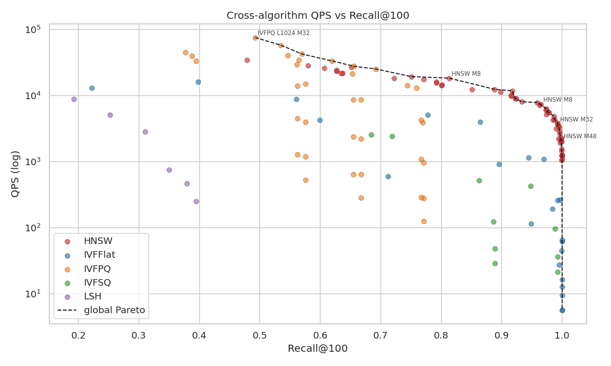

### 2.1. Рекомендованная конфигурация на семейство

| Семейство | Recall@100 | QPS | Mean lat. | Index size | Build | Peak RSS | Конфиг |
|---|---:|---:|---:|---:|---:|---:|---|
| **IVFFlat** | 0.9261 | 3,940 | 0.254 мс | 3.85 ГБ | 10.7 мин | 13.27 ГБ | `nlist=4096, nprobe=16` |
| **IVF+PQ** | 0.7515 | 18,898 | 0.053 мс | 75 МБ | 3.2 мин | 15.16 ГБ | `nlist=1024, nprobe=4, M=128, nbits=8` |
| **IVF+SQ** | 0.9243 | 7,650 | 0.131 мс | 1,012 МБ | 11.0 мин | 10.77 ГБ | `nlist=4096, nprobe=16, sq=SQ8` |
| **HNSW** | 0.9025 | 16,478 | 0.061 мс | 3.88 ГБ | 1.9 мин | 10.61 ГБ | `M=16, efConstruction=200, efSearch=40` |
| **LSH** | 0.3417 | 5,802 | 0.173 мс | 35 МБ | 8.4 с | 6.46 ГБ | `nbits=512` |

### 2.2. Лучший конфиг при Recall@100 ≥ 0.95

| Семейство | Recall@100 | QPS | Mean lat. | Index size | Build | Peak RSS | Конфиг |
|---|---:|---:|---:|---:|---:|---:|---|
| **IVFFlat** | 0.9581 | 1,101 | 0.910 мс | 3.94 ГБ | 42.8 мин | 13.21 ГБ | `nlist=16384, nprobe=64` |
| **IVF+SQ** | 0.9848 | 2,865 | 0.348 мс | 1,012 МБ | 11.0 мин | 10.77 ГБ | `nlist=4096, nprobe=64, sq=SQ8` |
| **HNSW** | 0.9685 | 10,460 | 0.095 мс | 3.88 ГБ | 1.9 мин | 10.61 ГБ | `M=16, efConstruction=200, efSearch=80` |

### 2.3. Победители по отдельным метрикам (по всему набору измерений)

- **Максимальный Recall@100:** IVFFlat = 1.0000, QPS = 16 (`nlist=1024, nprobe=1024`).
- **Максимальный QPS:** HNSW = 43,398, при Recall@100 = 0.496 (`M=8, efConstruction=200, efSearch=10`).
- **Минимальный размер индекса:** LSH = 9 МБ, Recall@100 = 0.220, QPS = 18,005 (`nbits=128`).
- **Самый быстрый билд:** LSH = 2.8 с, Recall@100 = 0.220, QPS = 18,005 (`nbits=128`).

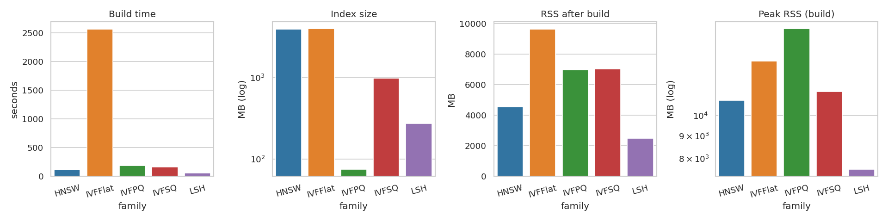

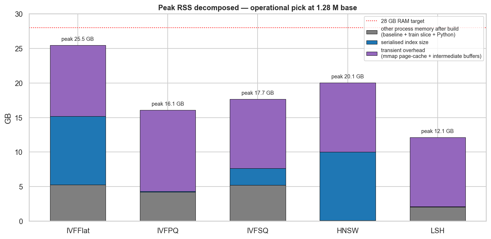

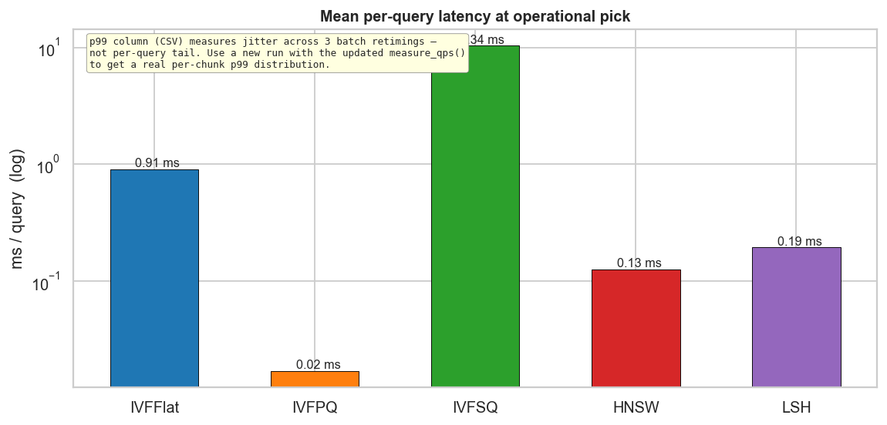

## 3. Анализ по семействам

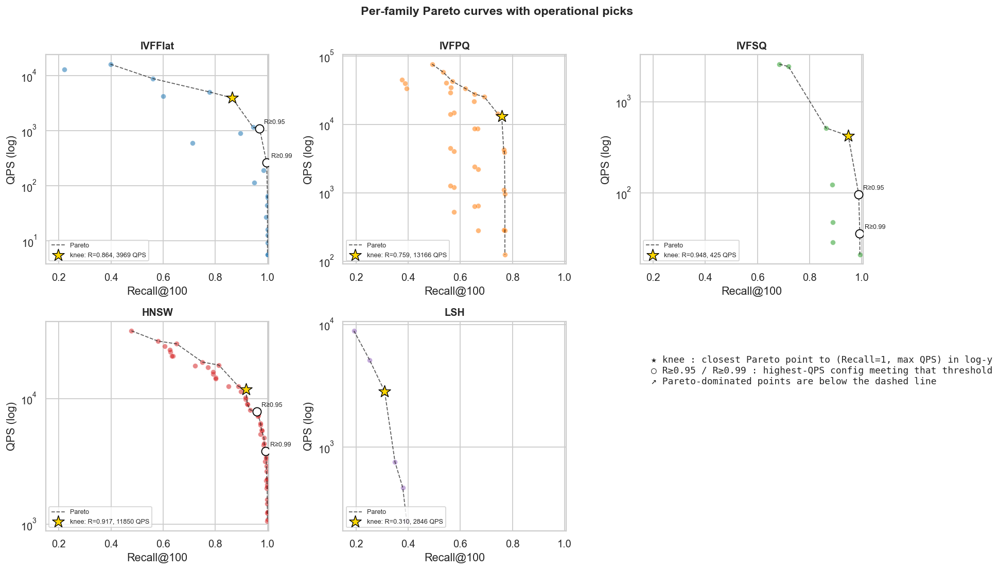

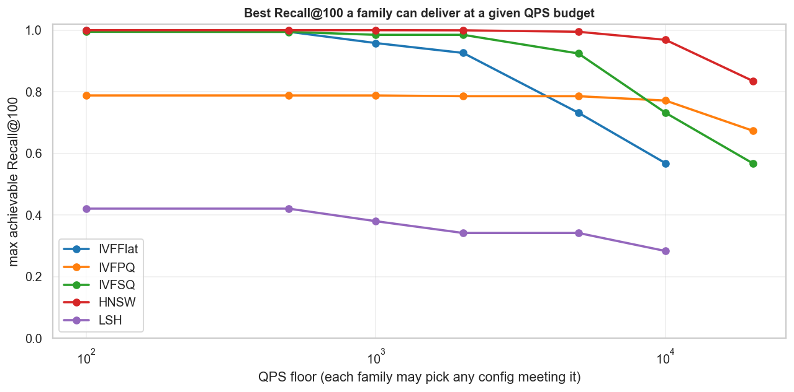

### 3.1. IVFFlat

- **Конфигов в выборке:** 23.
- **Recall@100:** от 0.182 (min) до 1.0000 (max).
- **QPS:** от 16 (min) до 14,582 (max).
- **Размер индекса:** от 3.82 ГБ до 3.94 ГБ.
- **Build:** от 44.3 с до 42.8 мин.

Лучшая конфигурация при каждом пороге Recall@100 (берём конфиг с максимальным QPS, чей recall ≥ порога):

| Порог Recall@100 | Конфиг | Recall@100 | QPS | Mean lat. |
|---:|---|---:|---:|---:|
| 0.99 | `nlist=16384, nprobe=256` | 0.9949 | 565 | 1.766 мс |
| 0.95 | `nlist=16384, nprobe=64` | 0.9581 | 1,101 | 0.910 мс |
| 0.90 | `nlist=4096, nprobe=16` | 0.9261 | 3,940 | 0.254 мс |
| 0.80 | `nlist=4096, nprobe=16` | 0.9261 | 3,940 | 0.254 мс |
| 0.50 | `nlist=1024, nprobe=1` | 0.5679 | 14,582 | 0.070 мс |
| 0.20 | `nlist=1024, nprobe=1` | 0.5679 | 14,582 | 0.070 мс |

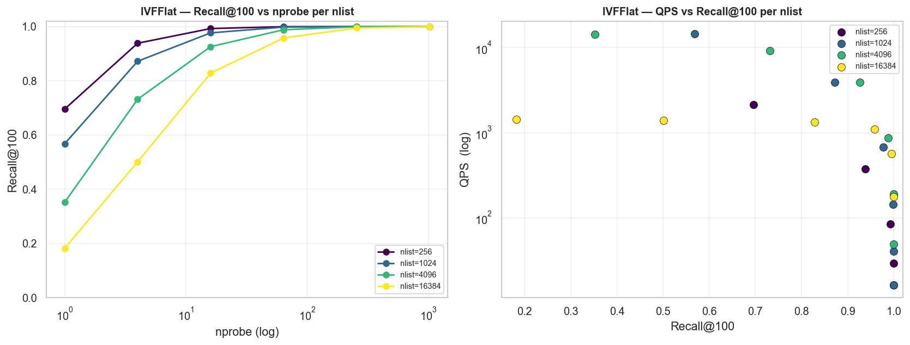

### 3.2. IVF+PQ

- **Конфигов в выборке:** 36.
- **Recall@100:** от 0.346 (min) до 0.7881 (max).
- **QPS:** от 255 (min) до 43,130 (max).
- **Размер индекса:** от 29 МБ до 99 МБ.
- **Build:** от 3.0 мин до 11.3 мин.

Лучшая конфигурация при каждом пороге Recall@100 (берём конфиг с максимальным QPS, чей recall ≥ порога):

| Порог Recall@100 | Конфиг | Recall@100 | QPS | Mean lat. |
|---:|---|---:|---:|---:|
| 0.50 | `nlist=1024, nprobe=1, M=64, nbits=8` | 0.5289 | 40,544 | 0.025 мс |
| 0.20 | `nlist=1024, nprobe=1, M=32, nbits=8` | 0.4999 | 43,130 | 0.024 мс |

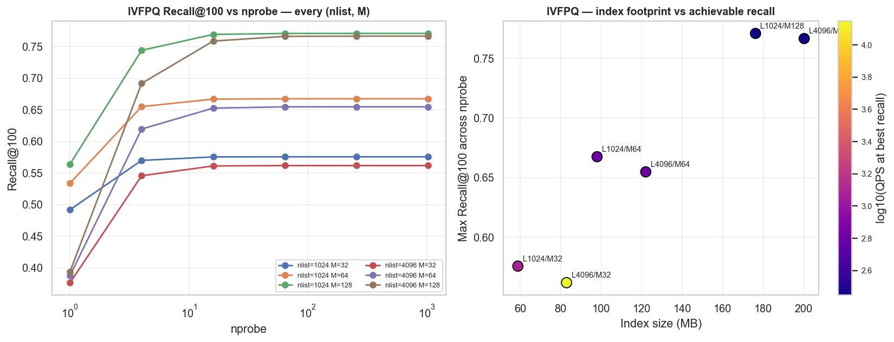

### 3.3. IVF+SQ

- **Конфигов в выборке:** 34.
- **Recall@100:** от 0.352 (min) до 0.9947 (max).
- **QPS:** от 68 (min) до 27,578 (max).
- **Размер индекса:** от 494 МБ до 1,012 МБ.
- **Build:** от 45.2 с до 11.0 мин.

Лучшая конфигурация при каждом пороге Recall@100 (берём конфиг с максимальным QPS, чей recall ≥ порога):

| Порог Recall@100 | Конфиг | Recall@100 | QPS | Mean lat. |
|---:|---|---:|---:|---:|
| 0.99 | `nlist=4096, nprobe=256, sq=SQ8` | 0.9943 | 810 | 1.235 мс |
| 0.95 | `nlist=4096, nprobe=64, sq=SQ8` | 0.9848 | 2,865 | 0.348 мс |
| 0.90 | `nlist=4096, nprobe=16, sq=SQ8` | 0.9243 | 7,650 | 0.131 мс |
| 0.80 | `nlist=1024, nprobe=4, sq=SQ8` | 0.8706 | 9,734 | 0.102 мс |
| 0.50 | `nlist=1024, nprobe=1, sq=SQ8` | 0.5678 | 27,578 | 0.037 мс |
| 0.20 | `nlist=1024, nprobe=1, sq=SQ8` | 0.5678 | 27,578 | 0.037 мс |

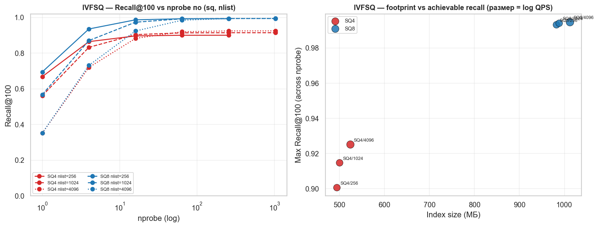

### 3.4. HNSW

- **Конфигов в выборке:** 56.
- **Recall@100:** от 0.496 (min) до 0.9999 (max).
- **QPS:** от 1,327 (min) до 43,398 (max).
- **Размер индекса:** от 3.85 ГБ до 4.00 ГБ.
- **Build:** от 49.7 с до 4.2 мин.

Лучшая конфигурация при каждом пороге Recall@100 (берём конфиг с максимальным QPS, чей recall ≥ порога):

| Порог Recall@100 | Конфиг | Recall@100 | QPS | Mean lat. |
|---:|---|---:|---:|---:|
| 0.99 | `M=16, efConstruction=200, efSearch=160` | 0.9909 | 6,286 | 0.159 мс |
| 0.95 | `M=16, efConstruction=200, efSearch=80` | 0.9685 | 10,460 | 0.095 мс |
| 0.90 | `M=16, efConstruction=200, efSearch=40` | 0.9025 | 16,478 | 0.061 мс |
| 0.80 | `M=8, efConstruction=200, efSearch=40` | 0.8352 | 22,408 | 0.045 мс |
| 0.50 | `M=16, efConstruction=200, efSearch=10` | 0.5943 | 34,493 | 0.029 мс |
| 0.20 | `M=8, efConstruction=200, efSearch=10` | 0.4959 | 43,398 | 0.023 мс |

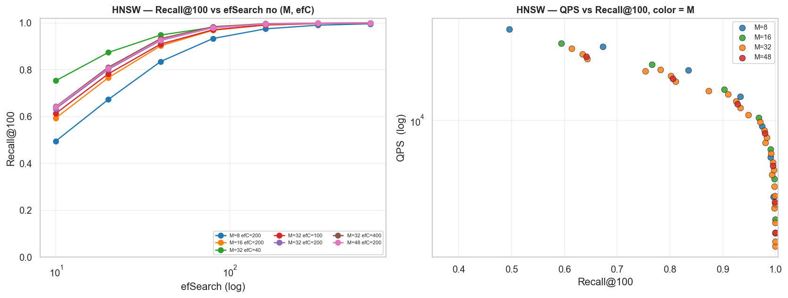

### 3.5. LSH

- **Конфигов в выборке:** 6.
- **Recall@100:** от 0.220 (min) до 0.4207 (max).
- **QPS:** от 517 (min) до 18,005 (max).
- **Размер индекса:** от 9 МБ до 276 МБ.
- **Build:** от 2.8 с до 1.0 мин.

Лучшая конфигурация при каждом пороге Recall@100 (берём конфиг с максимальным QPS, чей recall ≥ порога):

| Порог Recall@100 | Конфиг | Recall@100 | QPS | Mean lat. |
|---:|---|---:|---:|---:|
| 0.20 | `nbits=128` | 0.2200 | 18,005 | 0.056 мс |

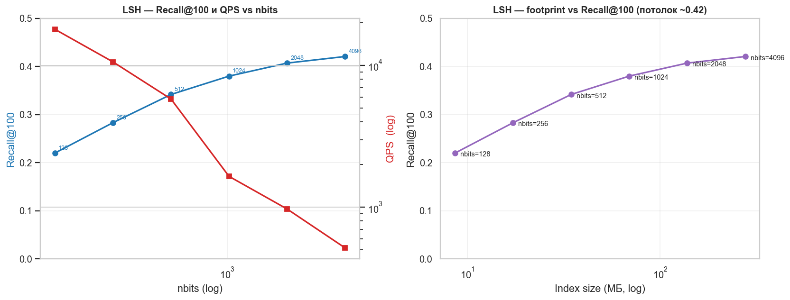

## 4. Масштабирование 100 K → 1 M

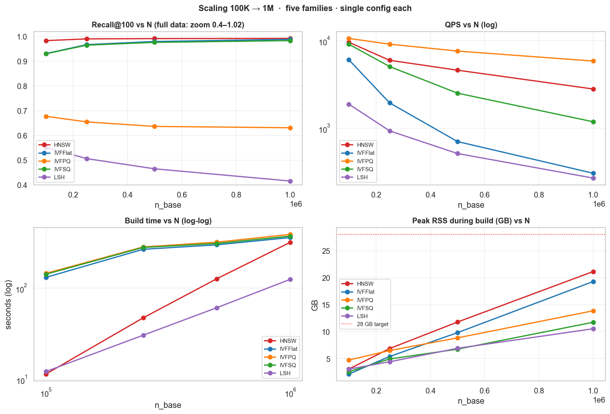

| Family | N | Recall@100 | QPS | Build | Peak RSS |
|---|---:|---:|---:|---:|---:|
| HNSW | 100,000 | 0.9830 | 9,626 | 11.5 с | 3.07 ГБ |
| HNSW | 250,000 | 0.9900 | 5,995 | 47.3 с | 6.87 ГБ |
| HNSW | 500,000 | 0.9910 | 4,620 | 2.1 мин | 11.77 ГБ |
| HNSW | 1,000,000 | 0.9920 | 2,817 | 5.3 мин | 21.12 ГБ |
| IVFFlat | 100,000 | 0.9307 | 6,061 | 2.2 мин | 2.15 ГБ |
| IVFFlat | 250,000 | 0.9668 | 1,955 | 4.4 мин | 5.40 ГБ |
| IVFFlat | 500,000 | 0.9794 | 707 | 5.0 мин | 9.81 ГБ |
| IVFFlat | 1,000,000 | 0.9880 | 307 | 6.0 мин | 19.27 ГБ |
| IVFPQ | 100,000 | 0.6774 | 10,656 | 2.4 мин | 4.74 ГБ |
| IVFPQ | 250,000 | 0.6549 | 9,162 | 4.7 мин | 6.49 ГБ |
| IVFPQ | 500,000 | 0.6366 | 7,640 | 5.3 мин | 8.84 ГБ |
| IVFPQ | 1,000,000 | 0.6312 | 5,875 | 6.5 мин | 13.86 ГБ |
| IVFSQ | 100,000 | 0.9298 | 9,122 | 2.4 мин | 2.59 ГБ |
| IVFSQ | 250,000 | 0.9647 | 5,084 | 4.6 мин | 4.93 ГБ |
| IVFSQ | 500,000 | 0.9759 | 2,525 | 5.1 мин | 6.75 ГБ |
| IVFSQ | 1,000,000 | 0.9830 | 1,189 | 6.2 мин | 11.73 ГБ |
| LSH | 100,000 | 0.5520 | 1,890 | 12.2 с | 3.06 ГБ |
| LSH | 250,000 | 0.5067 | 936 | 30.6 с | 4.42 ГБ |
| LSH | 500,000 | 0.4655 | 516 | 1.0 мин | 6.91 ГБ |
| LSH | 1,000,000 | 0.4162 | 271 | 2.1 мин | 10.53 ГБ |

## 5. Аномалии и data quality

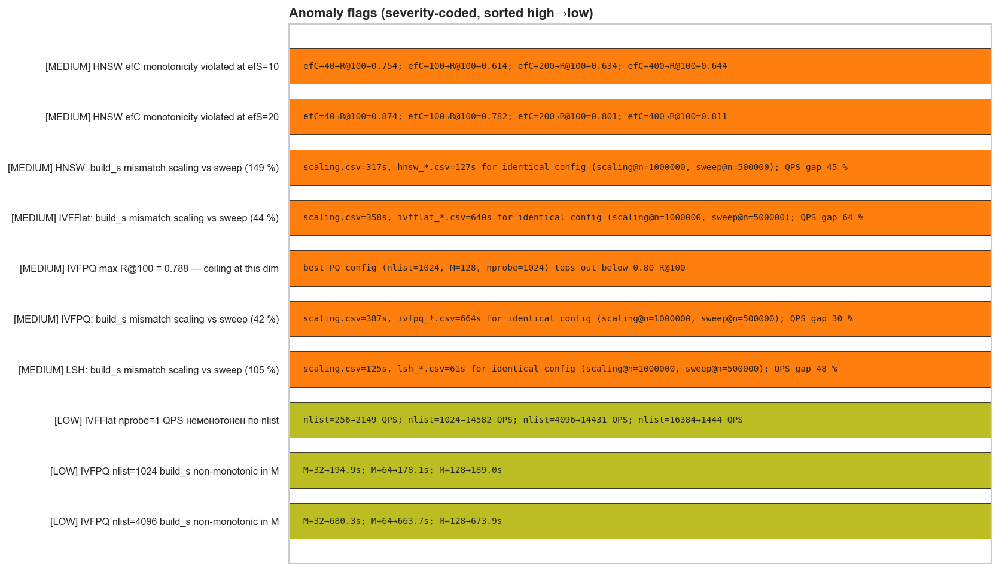

| # | Severity | Аномалия | Численное доказательство |
|---:|---|---|---|
| 1 | СРЕДНЯЯ | Recall HNSW немонотонен по efConstruction при низком efSearch | `efC=40→R@100=0.754; efC=100→R@100=0.614; efC=200→R@100=0.634; efC=400→R@100=0.644` |
| 2 | СРЕДНЯЯ | Recall HNSW немонотонен по efConstruction при низком efSearch | `efC=40→R@100=0.874; efC=100→R@100=0.782; efC=200→R@100=0.801; efC=400→R@100=0.811` |
| 3 | СРЕДНЯЯ | HNSW build_s расходится между scaling.csv и sweep CSV | `scaling.csv=317s, hnsw_*.csv=127s for identical config (scaling@n=1000000, sweep@n=500000); QPS gap 45 %` |
| 4 | СРЕДНЯЯ | IVFFlat build_s расходится между scaling.csv и sweep CSV | `scaling.csv=358s, ivfflat_*.csv=640s for identical config (scaling@n=1000000, sweep@n=500000); QPS gap 64 %` |
| 5 | СРЕДНЯЯ | Потолок Recall@100 у IVF+PQ | `best PQ config (nlist=1024, M=128, nprobe=1024) tops out below 0.80 R@100` |
| 6 | СРЕДНЯЯ | IVF+PQ build_s расходится между scaling.csv и sweep CSV | `scaling.csv=387s, ivfpq_*.csv=664s for identical config (scaling@n=1000000, sweep@n=500000); QPS gap 30 %` |
| 7 | СРЕДНЯЯ | LSH build_s расходится между scaling.csv и sweep CSV | `scaling.csv=125s, lsh_*.csv=61s for identical config (scaling@n=1000000, sweep@n=500000); QPS gap 48 %` |
| 8 | НИЗКАЯ | IVFFlat nprobe=1 QPS немонотонен по nlist | `nlist=256→2149 QPS; nlist=1024→14582 QPS; nlist=4096→14431 QPS; nlist=16384→1444 QPS` |
| 9 | НИЗКАЯ | Build_s немонотонен по M (PQ) | `M=32→194.9s; M=64→178.1s; M=128→189.0s` |
| 10 | НИЗКАЯ | Build_s немонотонен по M (PQ) | `M=32→680.3s; M=64→663.7s; M=128→673.9s` |

### 5.1. Cross-CSV консистентность

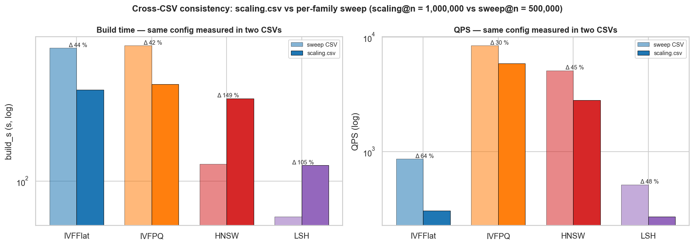

| Family | Конфиг | build_s sweep | build_s scaling | Δ build | QPS sweep | QPS scaling | Δ QPS |
|---|---|---:|---:|---:|---:|---:|---:|
| IVFFlat | `{'nlist': 4096, 'nprobe': 64}` | 640 с | 358 с | **44 %** | 865 | 307 | 64 % |
| IVF+PQ | `{'nlist': 4096, 'nprobe': 64, 'M': 64}` | 664 с | 387 с | **42 %** | 8,433 | 5,875 | 30 % |
| HNSW | `{'M': 32, 'efC': 200, 'efS': 160}` | 127 с | 317 с | **149 %** | 5,098 | 2,817 | 45 % |
| LSH | `{'nbits': 4096}` | 61 с | 125 с | **105 %** | 517 | 271 | 48 % |

## 6. Методология и caveats

- `LAB_QPS_REPEAT=3 LAB_QPS_WARMUP=1`, медиана из 3 запусков + per-chunk p99 (чанк = 50 запросов).
- Train slice = 200 000 векторов; при nlist=16384 это ~12 точек/центроид — FAISS пишет варнинг `lloyd_3`.
- Ground truth пересчитан локально через `IndexFlatL2`, кеш `data/gt_n1281167_k100.npy`.
- Peak RSS включает mmap-страницы базы (доминирует у IVFPQ/LSH).
- `scaling.csv` — отдельный code path: p99 ≈ mean, build_s у IVF в ~2× быстрее (без `cp.min_points_per_centroid=5`), см. §5.

## 7. Заключение и рекомендации

- **Поиск с высоким Recall@100 (≥ 0.95)** → **HNSW** `M=16, efConstruction=200, efSearch=80`: 10,460 QPS, 0.095 мс средняя latency, 3.88 ГБ на диске, 10.61 ГБ peak RSS (~58 % из которых — mmap-страницы базы, легко освобождаются ОС при необходимости). Для Recall@100 ≥ 0.99 — `M=16, efConstruction=200, efSearch=160` (R@100 = 0.9909, 6,286 QPS).
- **Минимальный размер индекса** → **IVF+PQ** `nlist=1024, nprobe=4, M=128, nbits=8`: 75 МБ (~53× меньше IVFFlat knee), Recall@100 = 0.752, 18,898 QPS. Потолок семейства — Recall@100 = 0.788 (M=128, 16 байт/вектор). Использовать как кандидат-генератор перед rerank-стадией на оригинальных векторах.
- **Компрессия с высоким recall** → **IVF+SQ-8** `nlist=4096, nprobe=64, sq=SQ8`: Recall@100 = 0.9848, 2,865 QPS, 1,012 МБ (~3.9× меньше IVFFlat knee). Per-query latency 0.35 мс — медленнее HNSW, потому что SQ декодирует значения на лету при вычислении дистанции, но в разы быстрее, чем IVFFlat на том же recall.
- **Точный (exact-ish) baseline** → **IVFFlat** `nlist=16384, nprobe=64`: Recall@100 = 0.9581, 1,101 QPS, 3.94 ГБ. Build 42.8 мин. Сборка дорогая, QPS низкий — но индекс хранит сырые float-векторы, поэтому recall максимально приближен к точному поиску. Полезен как калибратор Ground Truth, не как serving-движок.
- **LSH непригоден на этом датасете** — даже при `nbits=4096` (276 МБ индекс) Recall@100 = 0.421. При 2048-D случайные гиперплоскости требуют экспоненциального числа бит на единицу cosine-разрешения — footprint уходит за PQ задолго до того, как recall становится приемлемым.

**Итог:** HNSW (`M=16, efConstruction=200, efSearch=80`) — дефолтный выбор для high-recall поиска; IVF+PQ — только в связке с rerank-стадией; IVF+SQ-8 — компромисс по размеру/latency, если QPS-бюджет небольшой и хочется ×4 компрессии; IVFFlat — оффлайн-калибровка GT; LSH — отбросить для этого датасета.

_Полные CSV — `results/full/`. Графики — `docs/img/full/`. Регенерация — `python3 scripts/analyze_and_report.py --run full`._